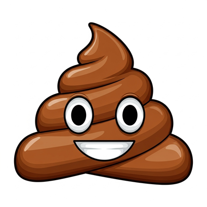

# shit

Shit, my friend, is that inevitable, earthy reminder that what goes in must, eventually, come out. It's the grand finale of digestion, the culinary curtain call, if you will, often arriving with a sense of urgent purpose. Think of it as your body's way of saying, "Alright, I've had enough of that pizza, let's make room for more!" It's a natural byproduct, a rather odorous masterpiece, and proof that even our insides are full of surprises. So, next time nature calls, just remember you're contributing to the grand cycle of life, one… well, you know… at a time.

